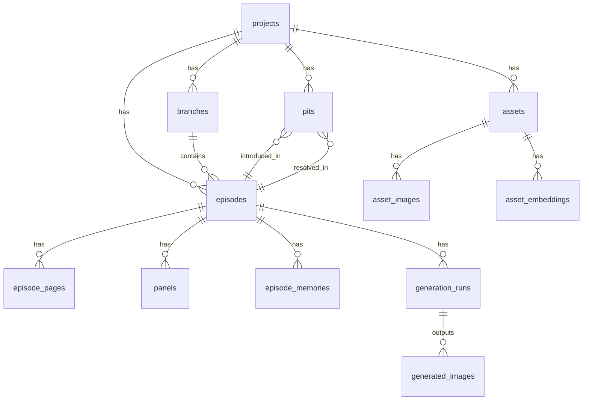

# A) MVP 用户故事（User Stories）+ 验收标准（AC）

> 说明：我按 Epic → Story → AC 的方式写，MVP 以“闭环”为目标：导入 → 理解/记忆 → 生成脚本 → 生图 → 排版 → 回写与可追溯。

## Epic 1：项目与作品管理（Projects）

### US-PJ-01 创建作品

- **作为** 用户
- **我希望** 创建一个作品 Project（名称/语言/标签）
- **以便** 后续在同一作品下管理集数、资产、分支
  **AC**

1. 可以输入 `title`、`language`（zh/ja/en）、`description`（可选）
2. 创建后返回 Project ID，并可在列表中看到
3. Project 默认创建 `main` 分支存在（逻辑分支）

### US-PJ-02 浏览/搜索作品

**AC**

1. 按 title 关键词搜索
2. 支持按更新时间排序
3. 点击进入作品详情页（Episodes/Assets/Pits/Branches）

---

## Epic 2：导入与集管理（Episodes & Import）

### US-IM-01 导入本地漫画资源（按集）

- **作为** 用户
- **我希望** 导入一个文件夹/zip，其中包含多集漫画
- **以便** 初始化作品资料
  **AC**

1. 支持上传 zip 或指定服务器路径（自托管时常用）
2. 能按规则识别集数：例如 `ep_001/`、`001/`、`第001话/`（至少支持一种规则，其他可配置）
3. 每集至少记录：集号、页数、每页图片路径、来源=local_import
4. 若同一集重复导入：可选择“跳过/覆盖/作为新版本导入”（MVP 可先做跳过+覆盖）

### US-IM-02 导入单集追加（增量）

**AC**

1. 支持导入 `episode_number = N` 的新图片
2. 导入后触发“理解/摘要生成”队列任务（可异步）
3. 导入后的图片可在 UI 浏览（页码顺序正确）

### US-IM-03（可选，插件）从 URL 爬取导入

**AC**

1. 爬虫作为插件模块，默认关闭
2. 用户明确提供 URL/规则后可运行
3. 输出与本地导入一致的数据结构（Episode/Pages）

---

## Epic 3：漫画理解（Vision → Text）

### US-VI-01 生成每集梗概与事件列表

- **作为** 用户
- **我希望** 系统对导入的每一集生成摘要
- **以便** 后续续写时保持连贯
  **AC**

1. 对每集生成 `summary`（200~600字可配置）
2. 生成 `events[]`（结构化：事件标题、参与角色、地点、结果）
3. 生成 `state_changes[]`（谁获得/失去什么；受伤；关系变化；装备变化）
4. 结果保存到 DB，并能在该集详情页查看

### US-VI-02 识别对话文本（OCR，可选）

**AC**

1. 能对每页执行 OCR 并保存 text（允许低质量，MVP 可不做气泡定位）
2. 可开关：不开则跳过 OCR 节省资源
3. OCR 结果可参与摘要生成（RAG 索引）

### US-VI-03（可选）分镜切分：页 → 格

**AC**

1. 在配置开启时，对页图生成 panel crops
2. 每个 panel 有 `page_index`, `panel_index`, crop bbox
3. panel 图片可被下游“角色资产发现”或“提示词参考”使用

---

## Epic 4：长期记忆与知识库（Memory/RAG）

### US-ME-01 建立作品知识库（RAG）

- **作为** 用户
- **我希望** 初始化时导入的简介、人设、每集摘要进入知识库
- **以便** 以后生成无需重复上传
  **AC**

1. 支持导入文本资料（txt/md/json）
2. 系统将文本切块、向量化并入库（向量 DB）
3. 每个 chunk 有来源（人物设定/世界观/第N集摘要/OCR等）
4. 生成脚本时会从知识库检索 K 条并写入 prompt（可在日志查看）

### US-ME-02 三层记忆视图

**AC**

1. 系统维护：
   - `canon_rules`（硬设定，手动编辑为主）
   - `long_summary`（历史压缩摘要，自动维护）
   - `recent_window`（最近 N 集详细摘要/脚本）
2. 用户可配置 N（默认 3~5）

---

## Epic 5：埋坑与节奏（Pits & Pacing）

### US-PT-01 埋坑列表管理（你提出的#1）

**AC**

1. 可新增坑：标题、描述、首次出现集、优先级、触发条件（文本即可）
2. 每次生成新集时，系统会给出“本集候选触发坑列表”（可解释）
3. 坑可以标记为 resolved，并记录回收集数

### US-PC-01 主线/日常比例控制（你提出的#2）

**AC**

1. 用户生成时可选：`mode = mainline | slice_of_life | mixed`
2. mixed 模式支持一个参数（如 mainline_ratio 0~1）
3. 输出脚本在元数据中带 `episode_tags`（主线/日常/高潮/填坑等）

---

## Epic 6：分镜脚本生成（Script）

### US-SC-01 从某集继续生成下一集（你提出的#3/#5）

**AC**

1. 用户选择 base episode（例如 55）+ branch（main 或 fan）
2. 系统生成 episode 56 的：
   - outline（大纲）
   - storyboard（结构化分镜 JSON）
   - dialogues（对白）
3. 在生成前必须自动检索：
   - recent_window（最近 N 集）
   - relevant assets（人物/服装/地点）
   - unresolved pits（未回收坑）
4. 生成过程可查看“prompt + 检索到的记忆片段 + 模型参数”（审计）

### US-SC-02 一致性检查（Consistency Checks）

**AC**

1. 输出脚本经过规则检查：
   - 角色状态冲突（例如已死亡又出场）
   - 道具冲突（断剑又出现完整剑）
2. 检查失败：要么自动重写（retry N 次），要么返回警告并要求用户确认（MVP 先警告即可）

---

## Epic 7：生图与渲染（Rendering）

### US-RE-01 可插拔图像后端（ComfyUI 优先）

**AC**

1. 系统定义统一接口 `ImageBackend`
2. MVP 支持一个后端：ComfyUI HTTP API（或你定义的 mock）
3. 生成时保存：
   - prompt / negative prompt
   - seed
   - model/loras/control 参数
   - 输出图片路径
4. 支持失败重试、超时、并发限制（队列）

### US-RE-02 局部重绘（可选，V1）

**AC**

1. 用户选择 panel + mask
2. 输入修改指令
3. 生成新版本 panel 并保留旧版本（可回滚）

---

## Epic 8：排版与气泡（Layout/Lettering）

### US-LA-01 基础排版

**AC**

1. 支持至少 3 种模板：`1x1`, `2x2`, `3-panels`
2. 生成整页图并保存
3. 支持导出 PNG（MVP），PDF（V1）

### US-LT-01 程序化对白气泡（不交给生图模型）

**AC**

1. 对每个 panel 的对白生成气泡层（svg/rgba）
2. 支持至少两种：对话框、旁白框
3. 气泡位置规则：默认右上/左下等简单策略（MVP 可粗糙但要可用）

---

## Epic 9：分支与版本控制（Branch/Fork/Merge）

### US-BR-01 从某集 fork 分支（你提出的#5）

**AC**

1. 任意 episode 可 fork：生成新 branch_name
2. fork 后该分支继承：
   - 记忆快照（long_summary + recent_window）
   - pits 状态
   - asset references
3. UI 可在分支视图切换浏览

### US-BR-02 导入官方新集并触发“补充理解”

**AC**

1. 在 main 分支导入 official episode 56
2. 系统自动运行理解任务并更新：
   - 资产发现
   - 世界观补充建议（变更列表）

### US-BR-03 diff（MVP 可简化为文本 diff）

**AC**

1. 同一 episode_number 在不同分支存在时，可对比：
   - 摘要差异（文本 diff）
   - 设定差异（state_changes diff）
2. 输出 diff 报告可保存

---

## Epic 10：资产化（Assets）—— MVP 先“半自动”

### US-AS-01 资产库基本形态（你提出的#6）

**AC**

1. 用户可手动创建资产（人物/服装/场景/物品/风格）
2. 每个资产有：
   - name
   - type
   - tags/prompt_snippets
   - reference images（可选）
3. 脚本生成时可引用 asset_id，并自动拼 prompt

### US-AS-02（V1）自动发现资产

**AC**

1. 从新导入的集里，系统提出“可能新人物/新服装/新场景”候选
2. 用户一键确认后加入资产库
3. 资产候选至少基于简单聚类/embedding（可先做 heuristics）

---

# B) 数据库 ERD / 表结构草案（可直接建库）

下面给你一个“够用且可扩展”的 schema（Postgres 优先，SQLite 也能跑）。用 Mermaid 表示 ERD，然后是表字段建议。

## B1. ERD（Mermaid）



## B2. 表结构（核心表）

### `projects`

- `id` (uuid, pk)
- `title` (text, not null)
- `description` (text)
- `language` (text, default 'zh')
- `created_at` (timestamptz)
- `updated_at` (timestamptz)

### `branches`

- `id` (uuid, pk)
- `project_id` (uuid, fk projects.id)
- `name` (text, not null) — e.g. `main`, `fan-arc1`
- `base_branch_id` (uuid, nullable) — fork 来源
- `base_episode_id` (uuid, nullable) — 从哪一集 fork
- `created_at`, `updated_at`
- unique: (`project_id`, `name`)

### `episodes`

- `id` (uuid, pk)
- `project_id` (uuid, fk)
- `branch_id` (uuid, fk)
- `number` (int, not null) — 集号
- `title` (text)
- `source` (text) — `import_local|import_url|generated`
- `status` (text) — `imported|understood|scripted|rendered|published`
- `parent_episode_id` (uuid, nullable) — DAG：用于 fork/续接
- `created_at`, `updated_at`
- unique: (`branch_id`, `number`)

### `episode_pages`

- `id` (uuid, pk)
- `episode_id` (uuid, fk)
- `page_index` (int, not null)
- `image_path` (text, not null) — 原始页图
- `width` (int), `height` (int)
- `hash` (text) — 去重
- `created_at`
- unique: (`episode_id`, `page_index`)

### `panels`（可选；不开分镜切分就不填）

- `id` (uuid, pk)
- `episode_id` (uuid, fk)
- `page_index` (int)
- `panel_index` (int)
- `bbox` (jsonb) — {x,y,w,h}
- `image_path` (text) — crop 图
- `ocr_text` (text, nullable)
- unique: (`episode_id`, `page_index`, `panel_index`)

### `episode_memories`

- `id` (uuid, pk)
- `episode_id` (uuid, fk)
- `type` (text) — `summary|events|state_snapshot|ocr_dump|script_outline|storyboard_json|diff_report`
- `content` (jsonb or text) — 建议 jsonb
- `created_at`

> 说明：用“记忆表”统一承载各种结果，便于迭代；必要时再拆表优化。

### `assets`

- `id` (uuid, pk)
- `project_id` (uuid, fk)
- `type` (text) — `character|outfit|location|item|style`
- `name` (text, not null)
- `description` (text)
- `tags` (jsonb) — prompt 片段、属性
- `parent_asset_id` (uuid, nullable) — outfit 属于某 character；“子资产”支持
- `created_at`, `updated_at`

### `asset_images`

- `id` (uuid, pk)
- `asset_id` (uuid, fk)
- `kind` (text) — `reference|thumbnail|turnaround|lora_dataset`
- `image_path` (text)
- `meta` (jsonb) — bbox、来源集等
- `created_at`

### `asset_embeddings`（可选）

- `id` (uuid, pk)
- `asset_id` (uuid, fk)
- `model` (text) — e.g. `clip-vit-l`
- `vector` (vector) — pgvector 或存 json
- `created_at`

### `pits`

- `id` (uuid, pk)
- `project_id` (uuid, fk)
- `title` (text)
- `description` (text)
- `priority` (int default 0)
- `introduced_episode_id` (uuid, fk episodes.id)
- `resolved_episode_id` (uuid, nullable, fk episodes.id)
- `status` (text) — `open|resolved|abandoned`
- `trigger_hint` (text) — 触发条件文本
- `created_at`, `updated_at`

### `generation_runs`（审计与可复现核心）

- `id` (uuid, pk)
- `episode_id` (uuid, fk)
- `stage` (text) — `understand|script|render|layout|inpaint|train_lora`
- `backend` (text) — `openai|local-qwen|comfyui`
- `model` (text)
- `params` (jsonb) — temperature, seeds, steps, sampler…
- `prompt` (text, nullable)
- `retrieved_context` (jsonb, nullable) — RAG 命中片段
- `status` (text) — `queued|running|succeeded|failed`
- `error` (text, nullable)
- `created_at`, `finished_at`

### `generated_images`

- `id` (uuid, pk)
- `generation_run_id` (uuid, fk)
- `episode_id` (uuid, fk)
- `panel_id` (uuid, nullable) — 若对应某个 panel
- `image_path` (text)
- `meta` (jsonb) — seed、prompt_hash、尺寸、版本
- `created_at`

---

# C) 分镜脚本 JSON Schema（关键：让全链路对齐）

> 目标：LLM 输出必须稳定、可解析、可审计、可重渲染。  
> 建议你把它作为 `docs/storyboard.schema.json` 并在生成后做 JSON Schema 校验，失败就让 LLM 修复。

下面给一个“够用且可扩展”的 schema（Draft 2020-12 风格；你也可以降级 Draft-07）。

## C1. 顶层结构（Storyboard）

```json
{
  "$schema": "https://json-schema.org/draft/2020-12/schema",
  "$id": "https://example.org/manga/storyboard.schema.json",
  "title": "Manga Storyboard",
  "type": "object",
  "required": [
    "schema_version",
    "project",
    "episode",
    "style",
    "pacing",
    "pits",
    "cast",
    "pages"
  ],
  "properties": {
    "schema_version": { "type": "string", "enum": ["1.0"] },

    "project": {
      "type": "object",
      "required": ["project_id", "language"],
      "properties": {
        "project_id": { "type": "string" },
        "language": { "type": "string", "enum": ["zh", "ja", "en"] }
      },
      "additionalProperties": true
    },

    "episode": {
      "type": "object",
      "required": ["branch", "number", "title", "continuity"],
      "properties": {
        "branch": { "type": "string" },
        "number": { "type": "integer", "minimum": 1 },
        "title": { "type": "string" },
        "continuity": {
          "type": "object",
          "required": ["base_episode_number", "recent_window"],
          "properties": {
            "base_episode_number": { "type": "integer", "minimum": 1 },
            "recent_window": {
              "type": "array",
              "items": { "type": "integer", "minimum": 1 },
              "minItems": 1
            }
          },
          "additionalProperties": true
        }
      },
      "additionalProperties": true
    },

    "style": {
      "type": "object",
      "required": [
        "style_assets",
        "global_prompt",
        "global_negative_prompt",
        "render_preset"
      ],
      "properties": {
        "style_assets": {
          "type": "array",
          "items": { "type": "string" },
          "description": "Referenced style asset IDs (e.g. style lora, reference pack)"
        },
        "global_prompt": { "type": "string" },
        "global_negative_prompt": { "type": "string" },
        "render_preset": {
          "type": "string",
          "enum": ["manga_bw", "manga_gray", "anime_color", "custom"]
        }
      },
      "additionalProperties": true
    },

    "pacing": {
      "type": "object",
      "required": ["mode", "tags", "target_beats"],
      "properties": {
        "mode": {
          "type": "string",
          "enum": ["mainline", "slice_of_life", "mixed"]
        },
        "tags": { "type": "array", "items": { "type": "string" } },
        "target_beats": {
          "type": "array",
          "items": {
            "type": "string",
            "enum": [
              "setup",
              "daily",
              "conflict",
              "reveal",
              "climax",
              "resolution",
              "comedy",
              "foreshadow"
            ]
          }
        }
      },
      "additionalProperties": true
    },

    "pits": {
      "type": "object",
      "required": ["open", "used_this_episode", "resolved_this_episode"],
      "properties": {
        "open": { "type": "array", "items": { "type": "string" } },
        "used_this_episode": { "type": "array", "items": { "type": "string" } },
        "resolved_this_episode": {
          "type": "array",
          "items": { "type": "string" }
        }
      },
      "additionalProperties": true
    },

    "cast": {
      "type": "array",
      "items": {
        "type": "object",
        "required": ["character_asset_id", "name", "state"],
        "properties": {
          "character_asset_id": { "type": "string" },
          "name": { "type": "string" },
          "state": {
            "type": "object",
            "properties": {
              "injuries": { "type": "array", "items": { "type": "string" } },
              "mood": { "type": "string" },
              "outfit_asset_id": { "type": "string" },
              "props_asset_ids": {
                "type": "array",
                "items": { "type": "string" }
              }
            },
            "additionalProperties": true
          }
        },
        "additionalProperties": true
      }
    },

    "pages": {
      "type": "array",
      "minItems": 1,
      "items": { "$ref": "#/$defs/page" }
    }
  },
  "$defs": {
    "page": {
      "type": "object",
      "required": ["page_index", "layout", "panels"],
      "properties": {
        "page_index": { "type": "integer", "minimum": 1 },
        "layout": {
          "type": "object",
          "required": ["template", "reading_direction"],
          "properties": {
            "template": {
              "type": "string",
              "enum": ["1x1", "2x2", "3_panels", "4_koma", "custom"]
            },
            "reading_direction": { "type": "string", "enum": ["rtl", "ltr"] },
            "custom_grid": { "type": "array", "items": { "type": "object" } }
          },
          "additionalProperties": true
        },
        "panels": {
          "type": "array",
          "minItems": 1,
          "items": { "$ref": "#/$defs/panel" }
        }
      },
      "additionalProperties": true
    },

    "panel": {
      "type": "object",
      "required": [
        "panel_id",
        "shot",
        "scene",
        "characters",
        "action",
        "dialogue",
        "render"
      ],
      "properties": {
        "panel_id": { "type": "string" },

        "shot": {
          "type": "object",
          "required": ["camera", "framing", "angle"],
          "properties": {
            "camera": {
              "type": "string",
              "enum": ["wide", "medium", "closeup", "extreme_closeup"]
            },
            "framing": {
              "type": "string",
              "enum": ["single", "two_shot", "group", "over_shoulder"]
            },
            "angle": {
              "type": "string",
              "enum": [
                "eye_level",
                "high_angle",
                "low_angle",
                "bird_view",
                "worm_view"
              ]
            }
          },
          "additionalProperties": true
        },

        "scene": {
          "type": "object",
          "required": ["location_asset_id", "time", "mood"],
          "properties": {
            "location_asset_id": { "type": "string" },
            "time": {
              "type": "string",
              "enum": ["day", "night", "sunset", "dawn", "indoor", "unknown"]
            },
            "mood": { "type": "string" }
          },
          "additionalProperties": true
        },

        "characters": {
          "type": "array",
          "minItems": 0,
          "items": {
            "type": "object",
            "required": ["character_asset_id", "pose", "expression"],
            "properties": {
              "character_asset_id": { "type": "string" },
              "outfit_asset_id": { "type": "string" },
              "pose": { "type": "string" },
              "expression": { "type": "string" },
              "gaze": { "type": "string" },
              "hands": { "type": "string" },
              "props_asset_ids": {
                "type": "array",
                "items": { "type": "string" }
              }
            },
            "additionalProperties": true
          }
        },

        "action": {
          "type": "object",
          "required": ["summary"],
          "properties": {
            "summary": { "type": "string" },
            "beats": { "type": "array", "items": { "type": "string" } },
            "continuity_notes": {
              "type": "array",
              "items": { "type": "string" }
            }
          },
          "additionalProperties": true
        },

        "dialogue": {
          "type": "array",
          "items": {
            "type": "object",
            "required": ["type", "text"],
            "properties": {
              "type": {
                "type": "string",
                "enum": ["speech", "thought", "narration", "sfx"]
              },
              "speaker_character_asset_id": { "type": "string" },
              "text": { "type": "string" },
              "emotion": { "type": "string" }
            },
            "additionalProperties": true
          }
        },

        "render": {
          "type": "object",
          "required": ["prompt", "negative_prompt", "size", "seed_policy"],
          "properties": {
            "prompt": { "type": "string" },
            "negative_prompt": { "type": "string" },
            "size": {
              "type": "object",
              "required": ["width", "height"],
              "properties": {
                "width": { "type": "integer", "minimum": 256 },
                "height": { "type": "integer", "minimum": 256 }
              }
            },
            "seed_policy": {
              "type": "string",
              "enum": ["fixed", "random", "derive_from_panel_id"]
            },
            "loras": {
              "type": "array",
              "items": {
                "type": "object",
                "required": ["asset_id", "weight"],
                "properties": {
                  "asset_id": { "type": "string" },
                  "weight": { "type": "number" }
                }
              }
            },
            "references": {
              "type": "array",
              "items": {
                "type": "object",
                "required": ["asset_image_id", "purpose"],
                "properties": {
                  "asset_image_id": { "type": "string" },
                  "purpose": {
                    "type": "string",
                    "enum": ["style", "character", "pose", "composition"]
                  }
                }
              }
            },
            "controls": {
              "type": "array",
              "items": {
                "type": "object",
                "required": ["type"],
                "properties": {
                  "type": {
                    "type": "string",
                    "enum": ["canny", "pose", "depth", "seg", "reference_only"]
                  },
                  "strength": { "type": "number" }
                },
                "additionalProperties": true
              }
            }
          },
          "additionalProperties": true
        }
      },
      "additionalProperties": true
    }
  }
}
```

## C2. 你实际会怎么用这份 Schema

- **LLM 只负责产出 JSON**（outline + pages/panels）
- **程序负责**：
  1. 校验 JSON Schema
  2. 拼接全局 style prompt + panel prompt
  3. 调度 image backend 批量生成
  4. 排版 + 气泡渲染
  5. 回写 DB（episode_memories + generation_runs）

---

# D) 额外给你：可执行的拆分建议（帮助你真正“do it from scratch”）

## D1. 建议先写的 3 个“协议/接口”

1. `LLMBackend`

- `generate_storyboard(context) -> storyboard_json`
- `summarize_episode(images/text) -> summary/events/state_changes`

2. `ImageBackend`

- `generate(panel_render_request) -> image_path + meta`
- `inpaint(request) -> image_path + meta`

3. `Storage`

- `put_image(bytes)->path`
- `get_image(path)->bytes`
- `put_json(obj)->path`

这三个接口一旦定了，后面社区就能写插件适配。

## D2. MVP 的最小 pipeline（建议你写成一个命令）

- `mangaforge import ./my_manga/ --project XXX`
- `mangaforge understand --episode 1..55`
- `mangaforge generate --from 55 --to 56 --branch fan --mode mixed`
- `mangaforge render --episode 56`
- `mangaforge export --episode 56 --format png`
