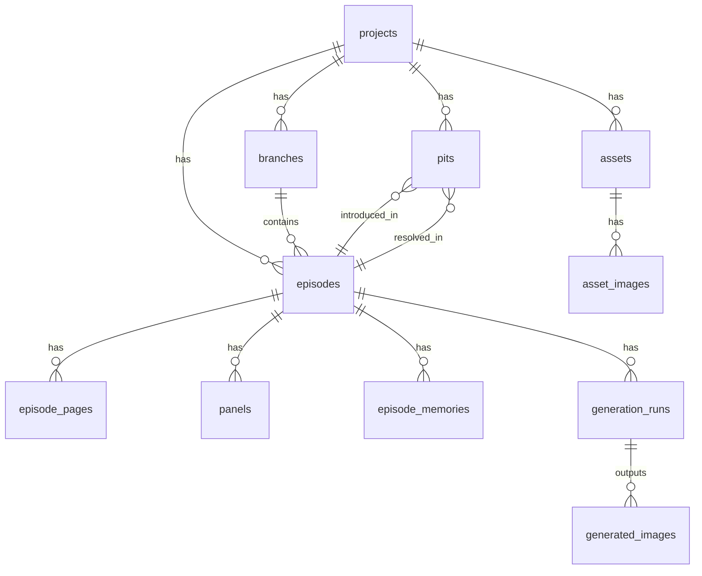

# MangaForge 技术设计方案

> 基于 PRD.md 与 design.md，面向 MVP 闭环的完整技术设计。

---

## 1. 技术栈选型

### 1.1 最终决定

| 层级 | 技术 | 版本 | 选型理由 |
|------|------|------|----------|
| **后端语言** | Python | 3.12+ | AI/ML 生态绝对优势：OpenAI/Anthropic SDK、Pillow/OpenCV、langchain、ComfyUI API 客户端均为 Python 一等公民；Go 在 AI 领域生态薄弱 |
| **后端框架** | FastAPI | 0.115+ | 原生 async、自动 OpenAPI 文档、Pydantic 校验、社区活跃；PRD 已推荐 |
| **ORM** | SQLAlchemy 2.0 + Alembic | - | Python 生态标准 ORM，支持 async，Alembic 做 DB 迁移 |
| **任务队列** | Celery + Redis | 5.4+ / 7.x | 生图/OCR/理解等耗时任务必须异步；Redis 同时做缓存和 Celery broker |
| **前端框架** | React 19 + TypeScript | - | 用户指定；生态最成熟 |
| **UI 组件库** | Semi UI | 2.x | 用户技术栈已包含；文档完善、组件丰富、字节跳动出品 |
| **CSS 方案** | TailwindCSS | 4.x | 用户指定；utility-first 与 Semi UI 共存无冲突 |
| **构建工具** | Vite | 6.x | 极速 HMR，React 生态主流 |
| **数据库** | MySQL | 8.0+ | 用户指定；JSON 列类型替代 Postgres JSONB |
| **向量库** | Qdrant | 1.x | Docker 一键部署、Python SDK 优秀、资源占用低、RAG 场景成熟；PRD 推荐 Qdrant/Chroma 中选 Qdrant 因其更适合生产环境 |
| **对象存储** | MinIO | - | S3 兼容、Docker 友好、存储漫画图片与生成结果 |
| **容器编排** | Docker Compose | - | 用户指定；一键启动全部基础设施 |

### 1.2 关键选型对比

**Python vs Go（后端语言）**

| 维度 | Python (FastAPI) | Go |
|------|-------------------|-----|
| AI/ML SDK | ✅ OpenAI/Anthropic/langchain 原生 | ❌ 需手写 HTTP client |
| 图像处理 | ✅ Pillow/OpenCV 成熟 | ⚠️ 绑定少，需 cgo |
| ComfyUI 集成 | ✅ 官方 Python API | ❌ 无官方支持 |
| 任务队列 | ✅ Celery 成熟方案 | ⚠️ asynq 可用但生态小 |
| RAG 框架 | ✅ langchain/llama-index | ❌ 几乎无 |
| API 性能 | ⚠️ 足够（async FastAPI） | ✅ 更高 |
| **结论** | **选定** | 放弃 |

AI 场景下 Python 是唯一合理选择。Go 的性能优势在本项目中不是瓶颈（瓶颈在 LLM/生图 I/O）。

---

## 2. 系统架构

### 2.1 整体架构图

```
┌─────────────────────────────────────────────────────────┐
│                    Browser (React SPA)                   │
│          Semi UI + TailwindCSS + Vite                    │
└──────────────────────┬──────────────────────────────────┘
                       │ HTTP / WebSocket
┌──────────────────────▼──────────────────────────────────┐
│                  FastAPI (API Server)                     │
│  ┌──────────┐ ┌──────────┐ ┌──────────┐ ┌────────────┐ │
│  │ Project  │ │ Episode  │ │  Asset   │ │ Generation │ │
│  │ Router   │ │ Router   │ │ Router   │ │ Router     │ │
│  └──────────┘ └──────────┘ └──────────┘ └────────────┘ │
│  ┌──────────┐ ┌──────────┐ ┌──────────┐ ┌────────────┐ │
│  │ Memory   │ │  Pit     │ │  Branch  │ │ Storage    │ │
│  │ Router   │ │ Router   │ │ Router   │ │ Router     │ │
│  └──────────┘ └──────────┘ └──────────┘ └────────────┘ │
│                     │                                    │
│           SQLAlchemy 2.0 (async)                         │
└───────┬─────────────┬──────────────┬────────────────────┘
        │             │              │
   ┌────▼────┐  ┌─────▼─────┐  ┌────▼─────┐
   │ MySQL   │  │  Qdrant   │  │  MinIO   │
   │ 8.0     │  │  (Vector) │  │ (S3)     │
   └─────────┘  └───────────┘  └──────────┘
        │
   ┌────▼────────────────────────────────────────────────┐
   │              Celery Workers                          │
   │  ┌────────────┐ ┌─────────────┐ ┌───────────────┐  │
   │  │ Understand │ │   Script    │ │    Render     │  │
   │  │  Worker    │ │   Worker    │ │    Worker     │  │
   │  └────────────┘ └─────────────┘ └───────────────┘  │
   │  ┌────────────┐ ┌─────────────┐                     │
   │  │   OCR      │ │   Layout    │                     │
   │  │  Worker    │ │   Worker    │                     │
   │  └────────────┘ └─────────────┘                     │
   └──────────────────────┬──────────────────────────────┘
                          │
                    ┌─────▼─────┐
                    │   Redis   │
                    │ (Broker)  │
                    └───────────┘
                          │
              ┌───────────┼───────────┐
              ▼           ▼           ▼
        ┌──────────┐ ┌────────┐ ┌──────────┐
        │ LLM API  │ │ComfyUI │ │  OCR     │
        │(OpenAI/  │ │(Image  │ │(Tesseract│
        │ Qwen/    │ │Backend)│ │ /Paddle) │
        │ Claude)  │ │        │ │          │
        └──────────┘ └────────┘ └──────────┘
```

### 2.2 核心数据流

```
导入漫画 → [Celery: OCR+理解] → 生成摘要/事件/状态变更 → 写入 MySQL + Qdrant
                                                                    │
用户请求生成 ← 检索记忆(RAG) ←──────────────────────────────────────┘
     │
     ▼
[Celery: 脚本生成] → 结构化分镜 JSON → 一致性检查 → 用户审阅
     │
     ▼
[Celery: 生图] → ComfyUI API → 单格图 → MinIO
     │
     ▼
[Celery: 排版] → 模板布局 + 气泡叠加 → 最终页面 → MinIO
     │
     ▼
回写 DB：新集摘要/状态/资产引用/生成记录
```

---

## 3. 项目结构

```
manga-forge/
├── apps/
│   ├── web/                          # React 前端
│   │   ├── src/
│   │   │   ├── pages/                # 页面组件
│   │   │   │   ├── ProjectList/
│   │   │   │   ├── ProjectDetail/
│   │   │   │   ├── EpisodeDetail/
│   │   │   │   ├── AssetManager/
│   │   │   │   ├── GenerationStudio/
│   │   │   │   ├── PitTracker/
│   │   │   │   └── MemoryViewer/
│   │   │   ├── components/           # 通用组件
│   │   │   ├── hooks/                # 自定义 hooks
│   │   │   ├── services/             # API 调用层
│   │   │   ├── stores/               # 状态管理 (zustand)
│   │   │   ├── layouts/              # 布局组件
│   │   │   ├── types/                # TypeScript 类型
│   │   │   └── utils/                # 工具函数
│   │   ├── index.html
│   │   ├── vite.config.ts
│   │   ├── tailwind.config.ts
│   │   ├── tsconfig.json
│   │   └── package.json
│   │
│   └── api/                          # FastAPI 后端
│       ├── app/
│       │   ├── main.py               # FastAPI 入口
│       │   ├── config.py             # 配置管理 (pydantic-settings)
│       │   ├── database.py           # DB 连接与会话
│       │   ├── models/               # SQLAlchemy ORM 模型
│       │   │   ├── project.py
│       │   │   ├── branch.py
│       │   │   ├── episode.py
│       │   │   ├── episode_page.py
│       │   │   ├── panel.py
│       │   │   ├── episode_memory.py
│       │   │   ├── asset.py
│       │   │   ├── asset_image.py
│       │   │   ├── pit.py
│       │   │   ├── generation_run.py
│       │   │   └── generated_image.py
│       │   ├── schemas/              # Pydantic 请求/响应模型
│       │   │   ├── project.py
│       │   │   ├── episode.py
│       │   │   ├── asset.py
│       │   │   ├── generation.py
│       │   │   └── ...
│       │   ├── routers/              # API 路由
│       │   │   ├── projects.py
│       │   │   ├── episodes.py
│       │   │   ├── assets.py
│       │   │   ├── branches.py
│       │   │   ├── pits.py
│       │   │   ├── memory.py
│       │   │   ├── generation.py
│       │   │   └── storage.py
│       │   ├── services/             # 业务逻辑层
│       │   │   ├── project_service.py
│       │   │   ├── episode_service.py
│       │   │   ├── asset_service.py
│       │   │   ├── memory_service.py
│       │   │   ├── generation_service.py
│       │   │   └── storage_service.py
│       │   ├── core/                 # 核心抽象
│       │   │   ├── llm_backend.py    # LLM 后端接口
│       │   │   ├── image_backend.py  # 生图后端接口
│       │   │   └── vector_store.py   # 向量库接口
│       │   └── dependencies.py       # FastAPI 依赖注入
│       ├── alembic/                  # 数据库迁移
│       │   ├── versions/
│       │   └── env.py
│       ├── alembic.ini
│       ├── pyproject.toml
│       └── Dockerfile
│
├── workers/                          # Celery Worker
│   ├── celery_app.py                 # Celery 配置与入口
│   ├── tasks/
│   │   ├── understand.py             # 漫画理解任务
│   │   ├── script_gen.py             # 脚本生成任务
│   │   ├── render.py                 # 生图任务
│   │   ├── layout.py                 # 排版任务
│   │   └── ocr.py                    # OCR 任务
│   ├── pipelines/                    # 流水线编排
│   │   ├── import_pipeline.py        # 导入流水线
│   │   └── generate_pipeline.py      # 生成流水线
│   └── Dockerfile
│
├── packages/
│   └── core/                         # 共享核心包
│       ├── mangaforge_core/
│       │   ├── schemas/              # 分镜脚本 JSON Schema
│       │   │   └── storyboard.schema.json
│       │   ├── prompts/              # LLM Prompt 模板
│       │   │   ├── summarize.py
│       │   │   ├── script_generate.py
│       │   │   └── consistency_check.py
│       │   ├── memory/               # 记忆系统
│       │   │   ├── rag.py
│       │   │   └── window.py
│       │   └── validators/           # JSON Schema 校验
│       │       └── storyboard.py
│       └── pyproject.toml
│
├── docker/
│   ├── docker-compose.yml            # 基础设施编排
│   ├── docker-compose.dev.yml        # 开发环境覆盖
│   ├── mysql/
│   │   └── init.sql                  # MySQL 初始化
│   └── qdrant/
│       └── config.yaml
│
├── docs/
│   ├── PRD.md
│   ├── design.md
│   └── architecture.md              # 本文档
│
├── .gitignore
├── Makefile                          # 常用命令快捷方式
└── README.md
```

---

## 4. 数据库设计（MySQL 8.0）

> 适配 PRD 中的 ERD，将 Postgres 特有类型转为 MySQL 兼容方案。
> - `uuid` → `CHAR(36)` + 应用层生成
> - `jsonb` → `JSON`
> - `timestamptz` → `DATETIME(6)`

### 4.1 ERD



### 4.2 表结构

#### `projects`

```sql
CREATE TABLE projects (
  id              CHAR(36)      NOT NULL PRIMARY KEY,
  title           VARCHAR(255)  NOT NULL,
  description     TEXT,
  language        VARCHAR(10)   NOT NULL DEFAULT 'zh',
  canon_rules     JSON          COMMENT '硬设定，手动编辑为主',
  long_summary    TEXT          COMMENT '历史压缩摘要，自动维护',
  created_at      DATETIME(6)   NOT NULL DEFAULT CURRENT_TIMESTAMP(6),
  updated_at      DATETIME(6)   NOT NULL DEFAULT CURRENT_TIMESTAMP(6) ON UPDATE CURRENT_TIMESTAMP(6),
  INDEX idx_title (title),
  INDEX idx_updated_at (updated_at)
) ENGINE=InnoDB DEFAULT CHARSET=utf8mb4 COLLATE=utf8mb4_unicode_ci;
```

#### `branches`

```sql
CREATE TABLE branches (
  id              CHAR(36)      NOT NULL PRIMARY KEY,
  project_id      CHAR(36)      NOT NULL,
  name            VARCHAR(100)  NOT NULL,
  base_branch_id  CHAR(36)      NULL     COMMENT 'fork 来源分支',
  base_episode_id CHAR(36)      NULL     COMMENT '从哪一集 fork',
  created_at      DATETIME(6)   NOT NULL DEFAULT CURRENT_TIMESTAMP(6),
  updated_at      DATETIME(6)   NOT NULL DEFAULT CURRENT_TIMESTAMP(6) ON UPDATE CURRENT_TIMESTAMP(6),
  UNIQUE KEY uk_project_branch (project_id, name),
  INDEX idx_project_id (project_id),
  CONSTRAINT fk_branches_project FOREIGN KEY (project_id) REFERENCES projects(id) ON DELETE CASCADE
) ENGINE=InnoDB DEFAULT CHARSET=utf8mb4 COLLATE=utf8mb4_unicode_ci;
```

#### `episodes`

```sql
CREATE TABLE episodes (
  id                CHAR(36)      NOT NULL PRIMARY KEY,
  project_id        CHAR(36)      NOT NULL,
  branch_id         CHAR(36)      NOT NULL,
  number            INT           NOT NULL,
  title             VARCHAR(255),
  source            VARCHAR(50)   NOT NULL DEFAULT 'import_local' COMMENT 'import_local|import_url|generated',
  status            VARCHAR(50)   NOT NULL DEFAULT 'imported' COMMENT 'imported|understood|scripted|rendered|published',
  parent_episode_id CHAR(36)      NULL     COMMENT 'DAG: fork/续接',
  created_at        DATETIME(6)   NOT NULL DEFAULT CURRENT_TIMESTAMP(6),
  updated_at        DATETIME(6)   NOT NULL DEFAULT CURRENT_TIMESTAMP(6) ON UPDATE CURRENT_TIMESTAMP(6),
  UNIQUE KEY uk_branch_number (branch_id, number),
  INDEX idx_project_id (project_id),
  INDEX idx_status (status),
  CONSTRAINT fk_episodes_project FOREIGN KEY (project_id) REFERENCES projects(id) ON DELETE CASCADE,
  CONSTRAINT fk_episodes_branch FOREIGN KEY (branch_id) REFERENCES branches(id) ON DELETE CASCADE
) ENGINE=InnoDB DEFAULT CHARSET=utf8mb4 COLLATE=utf8mb4_unicode_ci;
```

#### `episode_pages`

```sql
CREATE TABLE episode_pages (
  id          CHAR(36)      NOT NULL PRIMARY KEY,
  episode_id  CHAR(36)      NOT NULL,
  page_index  INT           NOT NULL,
  image_path  VARCHAR(500)  NOT NULL COMMENT 'MinIO object key',
  width       INT,
  height      INT,
  hash        CHAR(64)      COMMENT 'SHA-256 去重',
  created_at  DATETIME(6)   NOT NULL DEFAULT CURRENT_TIMESTAMP(6),
  UNIQUE KEY uk_episode_page (episode_id, page_index),
  INDEX idx_episode_id (episode_id),
  CONSTRAINT fk_pages_episode FOREIGN KEY (episode_id) REFERENCES episodes(id) ON DELETE CASCADE
) ENGINE=InnoDB DEFAULT CHARSET=utf8mb4 COLLATE=utf8mb4_unicode_ci;
```

#### `panels`

```sql
CREATE TABLE panels (
  id          CHAR(36)      NOT NULL PRIMARY KEY,
  episode_id  CHAR(36)      NOT NULL,
  page_index  INT           NOT NULL,
  panel_index INT           NOT NULL,
  bbox        JSON          COMMENT '{x, y, w, h}',
  image_path  VARCHAR(500)  COMMENT 'MinIO object key for crop',
  ocr_text    TEXT,
  UNIQUE KEY uk_episode_panel (episode_id, page_index, panel_index),
  INDEX idx_episode_id (episode_id),
  CONSTRAINT fk_panels_episode FOREIGN KEY (episode_id) REFERENCES episodes(id) ON DELETE CASCADE
) ENGINE=InnoDB DEFAULT CHARSET=utf8mb4 COLLATE=utf8mb4_unicode_ci;
```

#### `episode_memories`

```sql
CREATE TABLE episode_memories (
  id          CHAR(36)    NOT NULL PRIMARY KEY,
  episode_id  CHAR(36)    NOT NULL,
  type        VARCHAR(50) NOT NULL COMMENT 'summary|events|state_snapshot|ocr_dump|script_outline|storyboard_json|diff_report',
  content     JSON        NOT NULL,
  created_at  DATETIME(6) NOT NULL DEFAULT CURRENT_TIMESTAMP(6),
  INDEX idx_episode_type (episode_id, type),
  CONSTRAINT fk_memories_episode FOREIGN KEY (episode_id) REFERENCES episodes(id) ON DELETE CASCADE
) ENGINE=InnoDB DEFAULT CHARSET=utf8mb4 COLLATE=utf8mb4_unicode_ci;
```

#### `assets`

```sql
CREATE TABLE assets (
  id              CHAR(36)      NOT NULL PRIMARY KEY,
  project_id      CHAR(36)      NOT NULL,
  type            VARCHAR(50)   NOT NULL COMMENT 'character|outfit|location|item|style',
  name            VARCHAR(255)  NOT NULL,
  description     TEXT,
  tags            JSON          COMMENT 'prompt 片段、属性',
  prompt_snippets JSON          COMMENT '多语言 prompt 片段 {zh, ja, en}',
  parent_asset_id CHAR(36)      NULL     COMMENT 'outfit 属于某 character',
  created_at      DATETIME(6)   NOT NULL DEFAULT CURRENT_TIMESTAMP(6),
  updated_at      DATETIME(6)   NOT NULL DEFAULT CURRENT_TIMESTAMP(6) ON UPDATE CURRENT_TIMESTAMP(6),
  INDEX idx_project_type (project_id, type),
  INDEX idx_parent (parent_asset_id),
  CONSTRAINT fk_assets_project FOREIGN KEY (project_id) REFERENCES projects(id) ON DELETE CASCADE
) ENGINE=InnoDB DEFAULT CHARSET=utf8mb4 COLLATE=utf8mb4_unicode_ci;
```

#### `asset_images`

```sql
CREATE TABLE asset_images (
  id          CHAR(36)      NOT NULL PRIMARY KEY,
  asset_id    CHAR(36)      NOT NULL,
  kind        VARCHAR(50)   NOT NULL COMMENT 'reference|thumbnail|turnaround|lora_dataset',
  image_path  VARCHAR(500)  NOT NULL COMMENT 'MinIO object key',
  meta        JSON          COMMENT 'bbox、来源集等',
  created_at  DATETIME(6)   NOT NULL DEFAULT CURRENT_TIMESTAMP(6),
  INDEX idx_asset_id (asset_id),
  CONSTRAINT fk_asset_images_asset FOREIGN KEY (asset_id) REFERENCES assets(id) ON DELETE CASCADE
) ENGINE=InnoDB DEFAULT CHARSET=utf8mb4 COLLATE=utf8mb4_unicode_ci;
```

#### `pits`

```sql
CREATE TABLE pits (
  id                     CHAR(36)     NOT NULL PRIMARY KEY,
  project_id             CHAR(36)     NOT NULL,
  title                  VARCHAR(255) NOT NULL,
  description            TEXT,
  priority               INT          NOT NULL DEFAULT 0,
  introduced_episode_id  CHAR(36)     NOT NULL,
  resolved_episode_id    CHAR(36)     NULL,
  status                 VARCHAR(50)  NOT NULL DEFAULT 'open' COMMENT 'open|resolved|abandoned',
  trigger_hint           TEXT         COMMENT '触发条件文本',
  created_at             DATETIME(6)  NOT NULL DEFAULT CURRENT_TIMESTAMP(6),
  updated_at             DATETIME(6)  NOT NULL DEFAULT CURRENT_TIMESTAMP(6) ON UPDATE CURRENT_TIMESTAMP(6),
  INDEX idx_project_status (project_id, status),
  CONSTRAINT fk_pits_project FOREIGN KEY (project_id) REFERENCES projects(id) ON DELETE CASCADE,
  CONSTRAINT fk_pits_introduced FOREIGN KEY (introduced_episode_id) REFERENCES episodes(id),
  CONSTRAINT fk_pits_resolved FOREIGN KEY (resolved_episode_id) REFERENCES episodes(id)
) ENGINE=InnoDB DEFAULT CHARSET=utf8mb4 COLLATE=utf8mb4_unicode_ci;
```

#### `generation_runs`

```sql
CREATE TABLE generation_runs (
  id                CHAR(36)     NOT NULL PRIMARY KEY,
  episode_id        CHAR(36)     NOT NULL,
  stage             VARCHAR(50)  NOT NULL COMMENT 'understand|script|render|layout|inpaint|train_lora',
  backend           VARCHAR(100) COMMENT 'openai|local-qwen|comfyui',
  model             VARCHAR(100),
  params            JSON         COMMENT 'temperature, seeds, steps, sampler…',
  prompt            TEXT,
  retrieved_context JSON         COMMENT 'RAG 命中片段',
  status            VARCHAR(50)  NOT NULL DEFAULT 'queued' COMMENT 'queued|running|succeeded|failed',
  error             TEXT,
  created_at        DATETIME(6)  NOT NULL DEFAULT CURRENT_TIMESTAMP(6),
  finished_at       DATETIME(6)  NULL,
  INDEX idx_episode_stage (episode_id, stage),
  INDEX idx_status (status),
  CONSTRAINT fk_gen_runs_episode FOREIGN KEY (episode_id) REFERENCES episodes(id) ON DELETE CASCADE
) ENGINE=InnoDB DEFAULT CHARSET=utf8mb4 COLLATE=utf8mb4_unicode_ci;
```

#### `generated_images`

```sql
CREATE TABLE generated_images (
  id                 CHAR(36)     NOT NULL PRIMARY KEY,
  generation_run_id  CHAR(36)     NOT NULL,
  episode_id         CHAR(36)     NOT NULL,
  panel_id           CHAR(36)     NULL,
  image_path         VARCHAR(500) NOT NULL COMMENT 'MinIO object key',
  meta               JSON         COMMENT 'seed、prompt_hash、尺寸、版本',
  created_at         DATETIME(6)  NOT NULL DEFAULT CURRENT_TIMESTAMP(6),
  INDEX idx_run_id (generation_run_id),
  INDEX idx_episode_id (episode_id),
  CONSTRAINT fk_gen_images_run FOREIGN KEY (generation_run_id) REFERENCES generation_runs(id) ON DELETE CASCADE,
  CONSTRAINT fk_gen_images_episode FOREIGN KEY (episode_id) REFERENCES episodes(id) ON DELETE CASCADE
) ENGINE=InnoDB DEFAULT CHARSET=utf8mb4 COLLATE=utf8mb4_unicode_ci;
```

---

## 5. API 设计

### 5.1 设计原则

- RESTful 风格，资源名用复数
- 统一响应格式：`{ code: int, data: any, message: str }`
- 分页：`?page=1&page_size=20`
- 异步任务：返回 `task_id`，通过 `/tasks/{task_id}` 轮询或 WebSocket 推送

### 5.2 核心 API 列表

#### Projects

| Method | Path | Description |
|--------|------|-------------|
| POST | `/api/v1/projects` | 创建作品 |
| GET | `/api/v1/projects` | 作品列表（搜索+排序） |
| GET | `/api/v1/projects/{id}` | 作品详情 |
| PUT | `/api/v1/projects/{id}` | 更新作品 |
| DELETE | `/api/v1/projects/{id}` | 删除作品 |

#### Branches

| Method | Path | Description |
|--------|------|-------------|
| POST | `/api/v1/projects/{id}/branches` | 创建分支（fork） |
| GET | `/api/v1/projects/{id}/branches` | 分支列表 |
| GET | `/api/v1/branches/{id}` | 分支详情 |

#### Episodes

| Method | Path | Description |
|--------|------|-------------|
| POST | `/api/v1/projects/{id}/episodes/import` | 导入集（上传 zip/图片） |
| GET | `/api/v1/projects/{id}/episodes` | 集列表 |
| GET | `/api/v1/episodes/{id}` | 集详情（含页面、摘要） |
| PUT | `/api/v1/episodes/{id}` | 更新集 |
| GET | `/api/v1/episodes/{id}/pages` | 获取集的所有页面图 |
| GET | `/api/v1/episodes/{id}/memories` | 获取集的记忆数据 |
| POST | `/api/v1/episodes/{id}/understand` | 触发理解任务 |
| GET | `/api/v1/episodes/{id}/diff?target_episode_id=xxx` | 分支 diff |

#### Assets

| Method | Path | Description |
|--------|------|-------------|
| POST | `/api/v1/projects/{id}/assets` | 创建资产 |
| GET | `/api/v1/projects/{id}/assets` | 资产列表（按类型筛选） |
| GET | `/api/v1/assets/{id}` | 资产详情 |
| PUT | `/api/v1/assets/{id}` | 更新资产 |
| DELETE | `/api/v1/assets/{id}` | 删除资产 |
| POST | `/api/v1/assets/{id}/images` | 上传资产参考图 |

#### Pits

| Method | Path | Description |
|--------|------|-------------|
| POST | `/api/v1/projects/{id}/pits` | 创建坑 |
| GET | `/api/v1/projects/{id}/pits` | 坑列表（按状态筛选） |
| PUT | `/api/v1/pits/{id}` | 更新坑 |
| POST | `/api/v1/pits/{id}/resolve` | 标记坑已回收 |

#### Memory / RAG

| Method | Path | Description |
|--------|------|-------------|
| POST | `/api/v1/projects/{id}/memory/import` | 导入文本资料到知识库 |
| GET | `/api/v1/projects/{id}/memory/canon` | 获取硬设定 |
| PUT | `/api/v1/projects/{id}/memory/canon` | 更新硬设定 |
| GET | `/api/v1/projects/{id}/memory/summary` | 获取长期摘要 |
| POST | `/api/v1/projects/{id}/memory/search` | RAG 检索 |

#### Generation

| Method | Path | Description |
|--------|------|-------------|
| POST | `/api/v1/episodes/{id}/generate/script` | 生成脚本 |
| POST | `/api/v1/episodes/{id}/generate/render` | 生图 |
| POST | `/api/v1/episodes/{id}/generate/layout` | 排版 |
| GET | `/api/v1/generation/runs/{id}` | 生成任务状态 |
| GET | `/api/v1/episodes/{id}/generation-runs` | 生成历史 |

#### Tasks (异步任务通用)

| Method | Path | Description |
|--------|------|-------------|
| GET | `/api/v1/tasks/{task_id}` | 查询任务状态 |
| GET | `/api/v1/tasks/{task_id}/logs` | 任务日志 |

#### Storage

| Method | Path | Description |
|--------|------|-------------|
| GET | `/api/v1/storage/{bucket}/{key}` | 获取文件（代理 MinIO） |
| POST | `/api/v1/storage/upload` | 上传文件 |

---

## 6. 前端架构

### 6.1 技术栈

| 技术 | 版本 | 用途 |
|------|------|------|
| React | 19.x | UI 框架 |
| TypeScript | 5.x | 类型安全 |
| Semi UI | 2.x | 组件库 |
| TailwindCSS | 4.x | 样式 |
| Vite | 6.x | 构建工具 |
| Zustand | 5.x | 状态管理（轻量，比 Redux 简洁） |
| React Router | 7.x | 路由 |
| Axios | 1.x | HTTP 客户端 |
| TanStack Query | 5.x | 服务端状态管理（缓存、重试、轮询） |

### 6.2 页面结构

```
/                           → 首页（作品列表）
/projects/new               → 创建作品
/projects/:id               → 作品详情（概览）
/projects/:id/episodes      → 集列表
/projects/:id/episodes/:epId → 集详情（页面浏览 + 摘要 + 记忆）
/projects/:id/episodes/:epId/generate → 生成工作台（脚本→生图→排版）
/projects/:id/assets        → 资产管理
/projects/:id/pits          → 埋坑追踪
/projects/:id/memory        → 记忆与知识库
/projects/:id/branches      → 分支管理
```

### 6.3 核心页面设计

#### 作品列表页
- Semi UI `Table` + `Card` 展示作品
- 搜索框 + 排序（更新时间/名称）
- 创建作品弹窗

#### 集详情页
- 左侧：页面缩略图列表（可点击放大）
- 右侧：标签页切换（摘要/事件/状态变更/OCR/脚本）
- 顶部：集号、状态徽章、操作按钮（理解/生成/导出）

#### 生成工作台
- 步骤条：脚本生成 → 审阅 → 生图 → 排版 → 导出
- 脚本审阅：JSON 树形展示 + 关键字段高亮
- 生图进度：每格状态（排队/生成中/完成/失败）
- 排版预览：实时预览最终页面

#### 资产管理页
- 左侧：资产分类树（人物/服装/场景/道具/风格）
- 右侧：资产卡片网格/列表
- 资产详情抽屉：名称、描述、标签、参考图

### 6.4 Semi UI + TailwindCSS 共存策略

- Semi UI 负责组件逻辑与基础样式（表单、表格、弹窗、导航等）
- TailwindCSS 负责布局与自定义样式（间距、颜色、响应式）
- 使用 TailwindCSS 的 `@apply` 封装常用组合
- Semi UI 的 CSS 变量与 TailwindCSS 主题对齐

---

## 7. 核心模块设计

### 7.1 LLM Backend 抽象

```python
from abc import ABC, abstractmethod
from typing import Any

class LLMBackend(ABC):
    @abstractmethod
    async def generate_storyboard(self, context: dict) -> dict:
        """生成分镜脚本 JSON"""
        ...

    @abstractmethod
    async def summarize_episode(self, images: list[str], text: str | None) -> dict:
        """生成集摘要：summary + events + state_changes"""
        ...

    @abstractmethod
    async def check_consistency(self, storyboard: dict, canon: dict) -> dict:
        """一致性检查"""
        ...

class OpenAIBackend(LLMBackend):
    ...

class QwenBackend(LLMBackend):
    ...
```

### 7.2 Image Backend 抽象

```python
from abc import ABC, abstractmethod

class ImageBackend(ABC):
    @abstractmethod
    async def generate(self, prompt: str, negative_prompt: str,
                       size: tuple[int, int], seed: int | None,
                       loras: list[dict] | None,
                       controls: list[dict] | None) -> dict:
        """生成单格图，返回 {image_path, seed, meta}"""
        ...

    @abstractmethod
    async def inpaint(self, image_path: str, mask_path: str,
                      prompt: str, **kwargs) -> dict:
        """局部重绘"""
        ...

class ComfyUIBackend(ImageBackend):
    ...

class MockImageBackend(ImageBackend):
    ...
```

### 7.3 记忆系统（三层记忆 + RAG）

```python
class MemoryService:
    async def get_canon_rules(self, project_id: str) -> dict:
        """获取硬设定"""
        ...

    async def get_long_summary(self, project_id: str) -> str:
        """获取历史压缩摘要"""
        ...

    async def get_recent_window(self, project_id: str, branch_id: str,
                                 base_episode: int, window_size: int = 5) -> list[dict]:
        """获取最近 N 集详细摘要"""
        ...

    async def search_rag(self, project_id: str, query: str, top_k: int = 5) -> list[dict]:
        """RAG 检索：从 Qdrant 搜索相关记忆片段"""
        ...

    async def build_context_for_generation(self, project_id: str,
                                            branch_id: str,
                                            base_episode: int) -> dict:
        """组装生成所需的完整上下文：canon + long_summary + recent_window + RAG"""
        ...
```

### 7.4 Celery 任务流水线

```python
# 导入流水线
@celery_app.task(bind=True)
def import_pipeline(self, project_id: str, source: str, files: list[str]):
    # 1. 解压/识别集数
    # 2. 保存图片到 MinIO
    # 3. 创建 episode + episode_pages 记录
    # 4. 触发理解任务
    understand_task.delay(project_id, episode_ids)

# 生成流水线
@celery_app.task(bind=True)
def generate_pipeline(self, episode_id: str, config: dict):
    # 1. 组装上下文（记忆 + 资产 + 坑）
    # 2. 生成脚本
    # 3. 一致性检查
    # 4. 生图（并发）
    # 5. 排版 + 气泡
    # 6. 回写记忆
```

---

## 8. Docker Compose 基础设施

```yaml
# docker/docker-compose.yml
version: "3.8"

services:
  mysql:
    image: mysql:8.0
    environment:
      MYSQL_ROOT_PASSWORD: ${MYSQL_ROOT_PASSWORD:-mangaforge}
      MYSQL_DATABASE: ${MYSQL_DATABASE:-mangaforge}
      MYSQL_USER: ${MYSQL_USER:-mangaforge}
      MYSQL_PASSWORD: ${MYSQL_PASSWORD:-mangaforge}
    ports:
      - "3306:3306"
    volumes:
      - mysql_data:/var/lib/mysql
      - ./mysql/init.sql:/docker-entrypoint-initdb.d/init.sql
    command: >
      --character-set-server=utf8mb4
      --collation-server=utf8mb4_unicode_ci
      --default-authentication-plugin=caching_sha2_password
    healthcheck:
      test: ["CMD", "mysqladmin", "ping", "-h", "localhost"]
      interval: 10s
      timeout: 5s
      retries: 5

  redis:
    image: redis:7-alpine
    ports:
      - "6379:6379"
    volumes:
      - redis_data:/data
    healthcheck:
      test: ["CMD", "redis-cli", "ping"]
      interval: 10s
      timeout: 5s
      retries: 5

  qdrant:
    image: qdrant/qdrant:latest
    ports:
      - "6333:6333"
      - "6334:6334"
    volumes:
      - qdrant_data:/qdrant/storage
      - ./qdrant/config.yaml:/qdrant/config/production.yaml
    healthcheck:
      test: ["CMD", "curl", "-f", "http://localhost:6333/healthz"]
      interval: 10s
      timeout: 5s
      retries: 5

  minio:
    image: minio/minio:latest
    environment:
      MINIO_ROOT_USER: ${MINIO_ROOT_USER:-minioadmin}
      MINIO_ROOT_PASSWORD: ${MINIO_ROOT_PASSWORD:-minioadmin}
    ports:
      - "9000:9000"
      - "9001:9001"
    volumes:
      - minio_data:/data
    command: server /data --console-address ":9001"
    healthcheck:
      test: ["CMD", "curl", "-f", "http://localhost:9000/minio/health/live"]
      interval: 10s
      timeout: 5s
      retries: 5

volumes:
  mysql_data:
  redis_data:
  qdrant_data:
  minio_data:
```

### 开发环境覆盖

```yaml
# docker/docker-compose.dev.yml
version: "3.8"

services:
  mysql:
    ports:
      - "3306:3306"

  redis:
    ports:
      - "6379:6379"

  qdrant:
    ports:
      - "6333:6333"

  minio:
    ports:
      - "9000:9000"
      - "9001:9001"
```

---

## 9. 实现里程碑

### M0：项目骨架 + 数据模型 + 基础 CRUD（第 1-2 周）

**目标：前后端能跑通，能创建作品、导入集**

- [ ] 初始化 monorepo 结构
- [ ] Docker Compose 基础设施（MySQL + Redis + Qdrant + MinIO）
- [ ] FastAPI 项目骨架 + SQLAlchemy 模型 + Alembic 迁移
- [ ] Project / Branch / Episode CRUD API
- [ ] React 项目骨架 + Semi UI + TailwindCSS 配置
- [ ] 作品列表页 + 创建弹窗
- [ ] 集列表页 + 导入功能（上传 zip/图片）
- [ ] MinIO 文件上传/下载服务

### M1：记忆库 + 脚本生成（第 3-4 周）

**目标：能对导入的集生成摘要，能生成分镜脚本**

- [ ] LLM Backend 抽象 + OpenAI 适配器
- [ ] 漫画理解任务（摘要 + 事件 + 状态变更）
- [ ] Qdrant 向量化 + RAG 检索
- [ ] 三层记忆系统（canon + long_summary + recent_window）
- [ ] 分镜脚本生成（结构化 JSON）
- [ ] JSON Schema 校验
- [ ] 集详情页（摘要/事件/记忆标签页）
- [ ] 生成工作台 - 脚本生成步骤

### M2：生图 + 排版 + 导出（第 5-6 周）

**目标：从脚本到最终漫画页面**

- [ ] Image Backend 抽象 + ComfyUI 适配器
- [ ] 批量生图任务（并发 + 重试 + 队列）
- [ ] 基础排版模板（1x1, 2x2, 3_panels）
- [ ] 气泡叠加引擎（SVG/Canvas）
- [ ] PNG 导出
- [ ] 生成工作台 - 生图/排版步骤
- [ ] 生成记录审计（generation_runs）

### M3：闭环 + 埋坑 + 回写（第 7-8 周）

**目标：完整闭环，新集自动回写记忆**

- [ ] 埋坑管理（CRUD + 生成时候选触发）
- [ ] 节奏控制（主线/日常/混合模式）
- [ ] 一致性检查（角色状态冲突检测）
- [ ] 生成后自动回写（摘要 + 状态变更 + 资产引用）
- [ ] 埋坑追踪页
- [ ] 记忆管理页

### M4：分支 + 资产增强（第 9-10+ 周）

**目标：分支 fork/diff，资产半自动发现**

- [ ] 分支 fork（记忆快照 + 资产引用复制）
- [ ] 分支 diff（文本 diff + 设定 diff）
- [ ] 资产手动创建完善
- [ ] 资产候选发现（基于 embedding 聚类）
- [ ] 分支管理页
- [ ] 资产管理页增强

---

## 10. 配置管理

使用 `pydantic-settings` + `.env` 文件：

```bash
# .env
MYSQL_HOST=localhost
MYSQL_PORT=3306
MYSQL_USER=mangaforge
MYSQL_PASSWORD=mangaforge
MYSQL_DATABASE=mangaforge

REDIS_URL=redis://localhost:6379/0

QDRANT_URL=http://localhost:6333
QDRANT_COLLECTION=mangaforge

MINIO_ENDPOINT=localhost:9000
MINIO_ACCESS_KEY=minioadmin
MINIO_SECRET_KEY=minioadmin
MINIO_BUCKET=mangaforge

LLM_BACKEND=openai
OPENAI_API_KEY=sk-xxx
OPENAI_MODEL=gpt-4o

COMFYUI_URL=http://localhost:8188

CELERY_BROKER_URL=redis://localhost:6379/1
CELERY_RESULT_BACKEND=redis://localhost:6379/2
```

---

## 11. 关键设计决策记录

| # | 决策 | 理由 | 备选 |
|---|------|------|------|
| 1 | 后端选 Python | AI 生态绝对优势，Go 在 AI 领域生态薄弱 | Go |
| 2 | 向量库选 Qdrant | Docker 友好、Python SDK 优秀、资源占用低 | Milvus(重)、Chroma(单机弱) |
| 3 | 对象存储选 MinIO | S3 兼容、Docker 友好、可后续无缝迁移云 S3 | 本地文件系统(不可扩展) |
| 4 | 状态管理选 Zustand | 轻量、TypeScript 友好、无 boilerplate | Redux(重)、Jotai(生态小) |
| 5 | UUID 用 CHAR(36) | MySQL 原生无 UUID 类型，CHAR(36) 兼容性最好 | BINARY(16)(性能优但调试难) |
| 6 | 分镜脚本用 JSON Schema 校验 | 确保 LLM 输出可解析、可审计 | 纯文本 prompt(不可控) |
